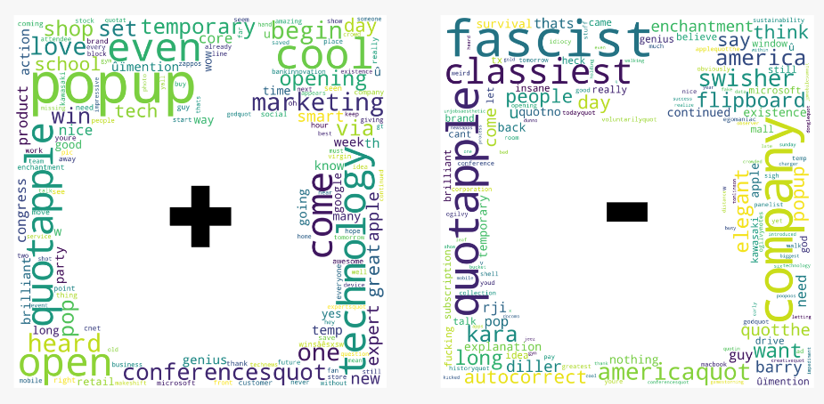

# Apple Twitter Sentiment Analysis  🐦


## Overview 🚀

We analyzed the tweets produced during SXSW 2013 festival to inform Apple what the people think about Apple and their products, especially the products being introduced in this. We also used the dataset to create a model using Natural Language Processing (NLP) tools to create a predictive model for sentiment analysis.

## Business Problem 💼


Can we perform twitter sentiment analysis to help our client, Apple, to improve their brand and create a model that is efficient and accurate in quickly responding to online discussion regarding their products?

## Data Understanding 🧐

The original dataset:
- Contained 9023 observations.
- Was obtained from CrowdFlower.
- Consisted of 9093 tweets made during technology conference in SXSW (South by Southwest) festival in 2013.
- Consisted of mentions of both Google and Apple.
- Also included the brand the tweets mentioned and the sentiment label of the tweets.

There are some limitations to our data. Some of those limitations are:
- _Imbalanced Target_: the dataset had about 5389 neutral sentiments, 2978 positive sentiments, and 570 negative sentiments.
- _Limited Representation_: Through outside research, we found that 40% of the monetized users are people between 25 to 34 years of age and 56.4% users are male.
- _Subjective Sentiment Labeling_: The data was manually labeled by human, which renders the sentiment labeling susceptible to human error.

We cleaned the data by:
- Changing the name of the columns
- Changing the sentiment labels to "positive", "negative", "neutral", and "unknown".
- Dropping other null values.

We filtered the data by:
- Filtering out "unknown" sentiment from our dataset.
- Filtering out Google-related tweets.
- Filtering out neutral sentiment tweets.

We then preprocess our dataset for NLP modeling by:
- Changing the observations to _lowercase_.
- Removing _punctuations_.
- Removing _numbers_.
- Removing _stopwords_.
- _Tokenizing_ the observations.

At this point, we used this dataset to analyze the Word Frequency Distribution and the WordCloud diagram of positive and negative sentiments of the iPhone, iPad, Apple Brand, and App.

However, for our model dataset, we undersampled the positive tweets by randomly collected 400 random tweets with positive sentiment. This was done to balance the 421 negative sentiment tweets that we had.

## Data Analysis 📊

__Word Frequency Distribution__

We first looked at the Frequency Distribution of the words in our dataset and found that people are excited about the presentation of the _new_ technology products.


__iPad WordCloud__

We then analyzed the wordcloud associated with positive and negative sentiments of the iPad. We found that people both think positively and negatively about the design of the iPad.

__iPhone WordCloud__

When we looked at the iPhone WordCloud, we found that people are concerned about the battery performance of the iPhone 5.

__Apple Company WordCloud__

We found that the public did not have a positive opinion on Apple as a company, with words such as "Fascist" appeared prominently on the WordCloud.

## Modeling 🤖
We tried different models and comparing their accuracy in predicting positive or negative sentiments against our baseline model. The dataset used for modeling consisted of 821 total observations.

For our models, we used the preprocessed tweets as the X and binary targets positive and negative as the y. We used the Label Encoder to denote the negative sentiment as 0 and the positive sentiment as 1. When then split our data to 80% to the training set and 20% to the test set.

For each of our models, we:
- Conducted a pipeline method of both the TF-IDF Vectorizer and the model.
- Ran a Grid Search to find the best hyperparameters for the Vectorizer and the model.
- Ran a Cross Validation.
- Analyzed the accuracy score.

We decided to use Multinomial Naive Bayes model as our baseline model. We also tested Logistic Regression, Random Forest, Decision Tree, Gradient Boost, and SGDClassifier models. The top 3 models according to accuracy were Multinomial Naive Bayes, Logistic Regression, and SGD classifer models.


__Result__: Our baseline model, _Multinomial Naive Bayes model_, produced the highest score with 76% accuracy score, while the Logistic Regression and the SGD classifier produced 75% and 74% accuracy scores, respectively.


## Recommendations 🎯

Through our analysis of the dataset, we recommend to:

- __Enhance External Communication__ 💬

The public has a negative opinion on Apple as a company. To remedy this, the marketing department needs to external communication to the customers needs to improve.

- __Improve Battery Life for the iPhone__ 🪫

People were concerned about whether the battery for iPhone 5 could withstand the tasks it required to hold. 

- __Refine iPad Design with a Slim Profile and Varied Colors__ 🤍🖤🧡💜

The public were divided in regards to the design of the iPad, some people like it and some people don't. Therefore, a non-radical improvements to the design should suffice, such as slim and other color options.

## Future Investigations 🔍

- __Expand choices beyond the base model__

As per our recommendation, the public seems to want more options in the product line-up.

- __Focus on customer relationship communications__

As external communication is a problem, we need to see which method of communication is best to relay Apple's core values to the public.

- __Obtain more recent data__

More present-day data would provide us with more up-to-date sentiments from the public along with the current line-up of products.

- __Use different source of sentiments__

Today, other than X, we have Threads that can be used for more resources for sentiment analysis.

## Outside Research 🔗

- [Twitter Background](https://www.searchlogistics.com/learn/statistics/twitter-user-statistics/#:~:text=There%20are%20237.8%20million%20monetizable,per%20day%20on%20the%20platform)


## Inquiries ❓

For complete analysis, please view our <a href="apple_twitter_sentiment_analysis.ipynb">Jupyter Notebook</a> and our <a href="apple_twitter_sentiment_presentation.pdf">Presentation</a>.

For technical and presentation questions, please contact any of our team members:
- Goknur Kaya at <a href="mailto:goknurkaya@gmail.com">goknurkaya@gmail.com</a>
- Andrei Hushcha at <a href="mailto:andrew.hushsca.com">andrew.hushcha@gmail.com</a>
- Andreas Budhi at <a href="mailto:ab41571.com">ab41571@gmail.com</a>


## Repository Structure 📂

```bash

├── Data                                     <- Dataset file used in this project

├── Images                                   <- Images and Graphs used in this project obtained from external and internal sources

├── .gitignore                               <- Contains list of files to be ignored from GitHub

├── apple_twitter_sentiment_analysis.ipynb   <- Jupyter Notebook of the project, containing code and analysis

├── apple_twitter_sentiment_presentation.pdf <- Presentation file of the project

└── README.md                                <- Jupyter notebook of the project containing codes and analysis
